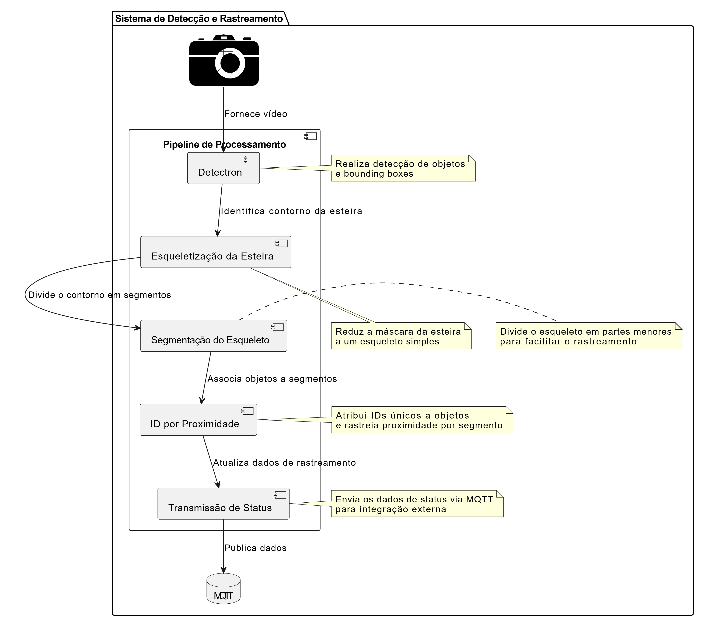

# Detecção de Pallets

# Preparação

Criar ambiente virtual

```
python -m venv pallet
```

```
pallet\Scripts\activate
```

```
python -m pip install --upgrade pip
```

---

# Instalação

Abrir o cmd e digitar:

```
pip install -r requirements.txt

```

**Instalar torch** 
```
pip install torch torchvision torchaudio --index-url https://download.pytorch.org/whl/cu124
```
**Instalar detectron**
```
python -m pip install "git+https://github.com/facebookresearch/detectron2.git"
```
Baixe os pesos, o link está no arquivo txt "link_pesos" e o coloque na pasta "output_pecas_dataset_368images_4classes_cam2lab10" ou digite os comandos abaixo
---
```
pip install gdown
```
```
gdown --id 105gSyR9z3jxFTLYnB9ApFzLyy-nKP2V- -O ./output_pecas_dataset_368images_4classes_cam2lab10/
```


# Execução

Escrever o texto abaixo no cmd ou clicar no run.bat

```
python deteccao_pallet.py
```

---

# Funcionamento

## Detecção (Detectron2)

O Detectron2 é utilizado para detectar e segmentar objetos em frames de vídeo. O código configura e carrega o modelo Mask R-CNN (pré-treinado com COCO) para identificar classes como `pallet`, `template, obj_u1 e obj_u2`. As detecções geram bounding boxes para processamento posterior. A biblioteca usa pesos treinados para realizar segmentação e identificar objetos baseados em limiares específicos. O modelo também hierarquiza detecções e rastreia objetos entre frames.

## Esqueletização da esteira

O processo de esqueletização ocorre no arquivo `segmento.py`. Ele transforma uma máscara binária da esteira em um esqueleto, simplificando o contorno para uma única linha. A função `skeletonize` gera o esqueleto, enquanto `cv2.findContours` extrai os contornos. O maior contorno é então dividido em segmentos de comprimento fixo para facilitar o rastreamento de objetos.

## Segmentação do esqueleto

A segmentação divide o maior contorno da esteira em partes menores, denominadas "segmentos". Cada segmento representa uma porção distinta do esqueleto. O processo é ajustado pelo comprimento do segmento (`segment_length`) e índice inicial (`start_index`). Essa divisão permite associar objetos detectados a regiões específicas do esqueleto, aprimorando o rastreamento espacial.

## Segmento mais próximo

O cálculo do segmento mais próximo usa as coordenadas do objeto (`x, y`). O sistema compara as distâncias entre o objeto e todos os pontos dos segmentos do esqueleto, identificando o segmento mais próximo. Se a menor distância estiver dentro do limite (`threshold`), o segmento é selecionado. Este processo vincula objetos detectados a regiões específicas da esteira.

## ID por proximidade de segmento

O rastreamento utiliza histórico de segmentos para atribuir IDs únicos aos objetos. Para cada novo objeto, o sistema avalia a proximidade com segmentos anteriores usando distância cíclica, reutilizando IDs quando possível. Se não houver segmento próximo o suficiente, cria-se um novo ID. Isso garante identificação e rastreamento consistentes dos objetos.

## Transmissão de status

O sistema transmite o status dos objetos rastreados via MQTT, incluindo IDs, posições e segmentos associados. A biblioteca `paho.mqtt.publish` envia os dados em formato JSON para um servidor MQTT.

```json
{
            "quantity" : quantidade de objetos,
            "pallets" : [
                {
                    "idPallet": id do objeto,
                    "segmento": segmento em que está,
                    "segmentoMax": número máximo de segmentos
                }
            ]
}
```

# Arquitetura


